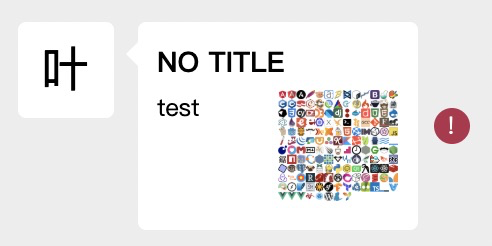

## wx-messager-vue

### Project setup
```
yarn install
```

### Compiles and hot-reloads for development
```
yarn dev
```

## 微信信息组件

本信息组件将信息分三块进行渲染：信息前缀、信息本体、信息后缀，分别为下图的红色、蓝色、黄色部分。


这三个部分均可以进行定制扩展以满足后续的需求变化。

### 信息数据结构

信息通过 `role` 和 `type` 两者来区分和扩展信息类型，其他为基本或扩展的信息字段。

```typescript
interface StyledProps {
    className?: string;
}
export enum Role {
    sender,
    recevier,
    system
}

export enum MessageStatus {
    loading,
    sent,
    failed
}

export interface IAuthor {
    name: string;
    thumbnail?: string;
}

export interface IMessage {
    content?: string;
    type: string;
    role: Role;
    status: MessageStatus;
    author: IAuthor;
}

export interface MessageProps extends StyledProps, React.HTMLAttributes<HTMLElement> {
    message: IMessage;
    render?: (message: IMessage) => React.ReactNode;
    messagePrefix?: (message: IMessage) => React.ReactNode;
    messagePostfix?: (message: IMessage) => React.ReactNode;
}
```

### 基本文本信息渲染

```html
<WeChatMessage
    className={className}
    onClick={onClick}
    message={message}
/>
```


### 定制信息本体的渲染逻辑

信息本体的渲染逻辑使用了 `render props`。外部只需使用时传入自己的 Component 的渲染函数即可。

```jsx
// link-message.tsx
// ...
const LinkMessage = ({ message }: LinkMessageProps):React.ReactElement => {
    return (
        <>
            <StyledLinkMessageTitle>{message.title}</StyledLinkMessageTitle>
            <StyledLinkMessageDescWrap>
                <StyledLinkMessageDesc>{message.desc}</StyledLinkMessageDesc>
                {
                    message.thumbnail
                        ?  <StyledLinkMessageThumb src={message.thumbnail}/>
                        : null
                }
            </StyledLinkMessageDescWrap>
        </>
    )
}

export default LinkMessage;
```

```jsx
import LinkMessage from "./link-message";

return (
    <WeChatMessage
        className={className}
        onClick={() => alert(message.url)}
        message={message}
        render={() => <LinkMessage message={message} />;}
    />
)
```



### 前缀和后缀的定制

这两者的扩展定制方式一样，均是通过 `WeChatMessage` 此基础组件内对外暴露两个钩子，分别为 `messagePrefix` 和 `messagePostfix`，来进行自定义渲染逻辑。

两个钩子函数均有两个参数，一个是信息数据 `message`，第二个是默认渲染。提供默认渲染是为了让扩展的渲染逻辑可以在原有的渲染基础上去进行便捷的定制，如果需要进行破坏式的渲染则直接忽略，自行渲染。

下面以微信个人发布短视频时头像会出现一个蓝色圆圈为例，来说明如果在原有基础上进行扩展：

```jsx

export default ({ message, defaultRender }: IProps) => {
    const Avatar = defaultRender;
    if (!message.author.hasNewVideo) return <Avatar/>;
    return (
        <>
            <Avatar/>
            <VideoMark/>
        </>
    )
}
```

```jsx
import AvatarWithVideoMark from "./avatar-with-video-mark";

return (
    <WeChatMessage
        className={className}
        message={message}
        messagePostfix={AvatarWithVideoMark}
    />
)
```


